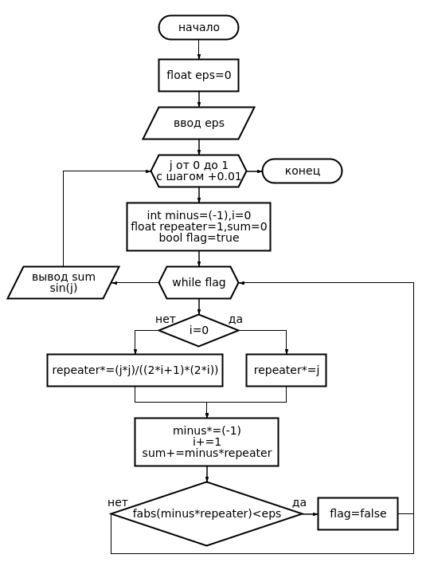
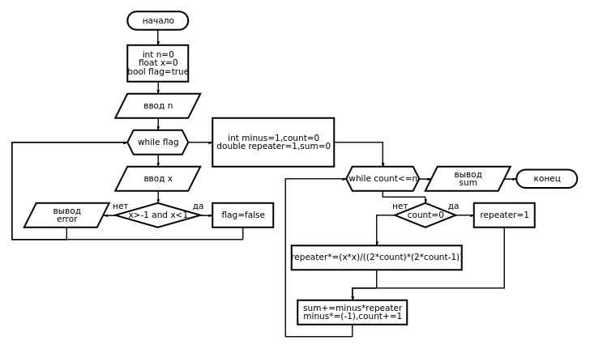
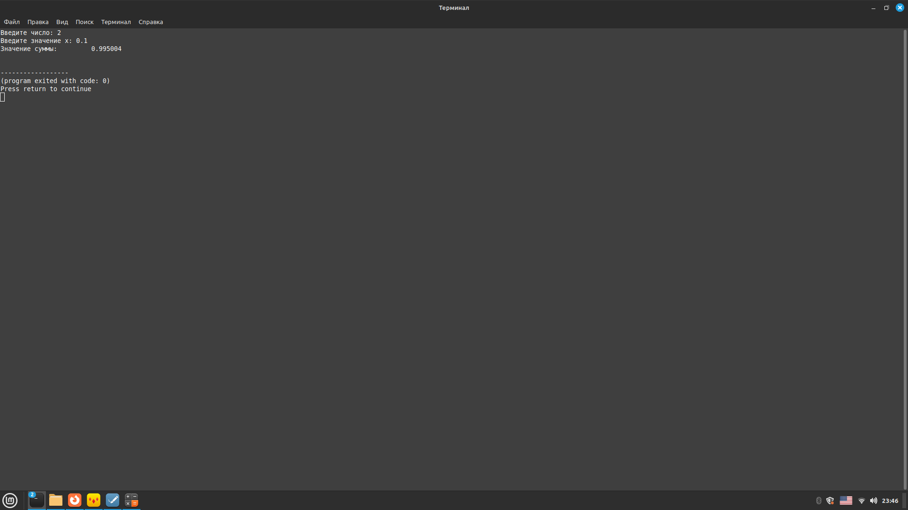

# Отчёт
## Лабораторная работа №6 Вариант 1


### Блок-схема

### Код
```cpp
#include <cstdlib>
#include <iostream>
#include <math.h>
#include <sstream>
#include <string>
using namespace std;
int main {
	int count=0, a=13;
	while(count!=100)
	{int j=0;
	int c = a;
	for (int i =int(log10(c)+1);i>=0;i--){j+=(c%10)*pow(10,i-1);c/=10;}
	if (a==j){cout<<a<<endl;count+=1;}
	a+=1;
	}
	//cout<<count;
	return 0; 
}	
```


### Блок-схема


### Код
```cpp
#include <cstdlib>
#include <iostream>
#include <math.h>
#include <sstream>
#include <string>

using namespace std;
int prime(int a);
int prime(int a)
{
	int count=2;
	bool flag=true;
	for (int i=2;i<=int(sqrt(a));i++) {
		if ((a%i)==0){count+=1;flag=false;break;}
		}
	if (flag){return true;}
	else {return false;}
}
void reverse_function(int b)
{
	int c=0;
	for (int i=int(log10(b)+1); i>0;i--)
	{
		c+=(b%10)*(pow(10,i-1));
		b=b/10;
		}
	cout<<"Перевернутое число: "<<c<<endl;//"\t";	
}
int main()
{
	int a=0,count=13;
	while (count!=0)
	{	cout<<"Введите число: ";cin>>a;
		//cout<<prime(a)<<"\t"<<a<<endl;
		//cout<<count<<endl;
		if (prime(a)){count-=1;}
		reverse_function(a);//cout<<a<<endl;
		}
	return 0; 
}	
```


### Блок-схема

### Код
```cpp
#include <cstdlib>
#include <iostream>
#include <math.h>
#include <sstream>
#include <string>

using namespace std;
int main()
{
	long long a=1,count=0,sum=0;
	cout<<"Введите число: ";cin>>count;
	while(count!=0)
	{
		if (a%5==0){sum+=a;count-=1;}//cout<<a<<'\t'<<count<<'\t'<<sum<<endl;}
		a+=1;
		}
	cout<<sum<<endl;
	return 0; 
}
```


### Блок-схема


### Код
```cpp
#include <cstdlib>
#include <iostream>
#include <math.h>
#include <sstream>
#include <string>
using namespace std;
int main()
{
	float eps=0;
	cout<<"Введите число eps: ";cin>>eps;
	for (float j=0;j<=1;j+=0.1)
	{
		int minus=(-1),i=0;
		float repeater=1,sum=0;
		bool flag=true;
		cout<<"Значение суммы: "<<'\t';
		while(flag)
		{
			if (i==0){repeater*=j;}
			else {repeater*=(j*j)/((2*i+1)*(2*i));}
			minus*=(-1);i+=1;
			sum+=minus*repeater;//cout<<"Сумма1 "<<sum<<"\t"<<(pow(j,2*i+1))<<" РЕПИТЕР "<<repeater<<endl;
			if (fabs(minus*repeater)<eps) {flag=false;}
			}
		cout<<sum<<endl;
		cout<<"Значение синуса: "<<'\t';
		cout<<sin(j)<<endl;
		cout<<endl;
	}
	
	return 0; 
}
```


### Блок-схема

### Код
```cpp
#include <cstdlib>
#include <iostream>
#include <math.h>
#include <sstream>
#include <string>
using namespace std;
long double fact(int N);
long double fact(int N)
{
    if(N < 0)
        return 0; 
    if (N == 0)
        return 1;
    else
        return N * fact(N - 1);
}
int main()
{
	int n=0;
	float sum=0,x=0;
	bool flag=true;
	cout<<"Введите число: ";cin>>n;
	while(flag)
	{
		cout<<"Введите значение x: ";cin>>x;
		if(x>-1 and x<1){flag=false;}
		else{cout<<"ошибка!"<<endl;}
		}
	for(int i=0;i<n;i++)
	{
		if (i%2==0){sum+=(pow(x,(2*i))/fact(2*i));}
		else {sum+=(-1)*(pow(x,(2*i))/fact(2*i));}
		}
	cout<<"Сумма ряда: "<<sum;
	return 0;
}
```

